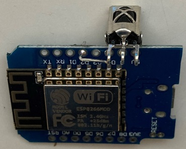
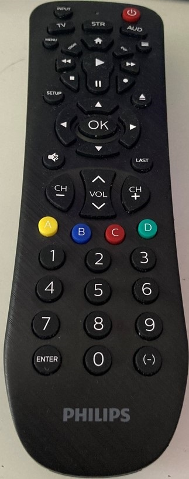
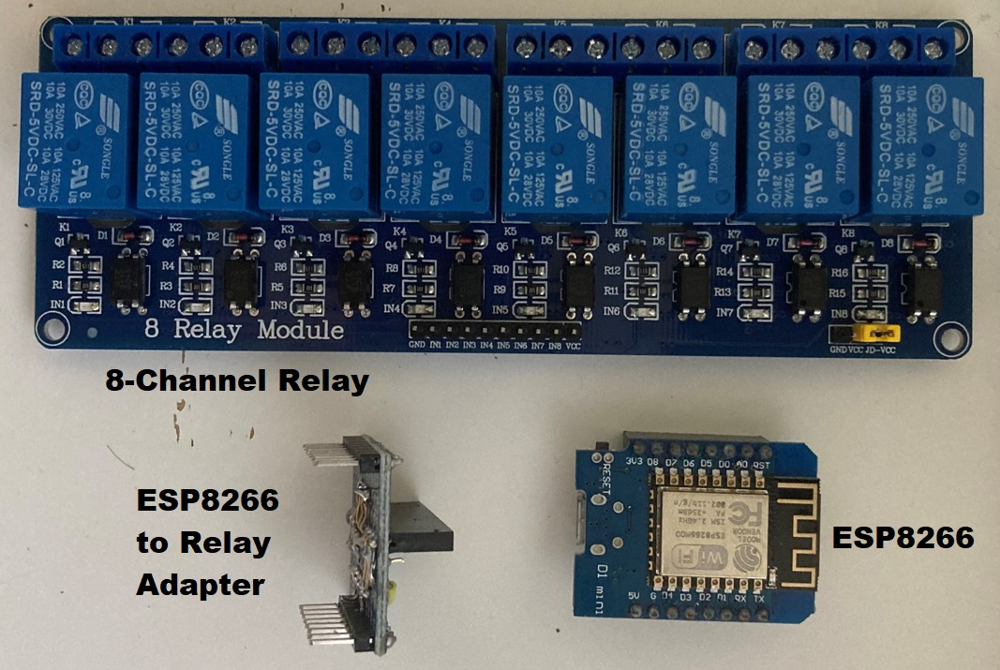
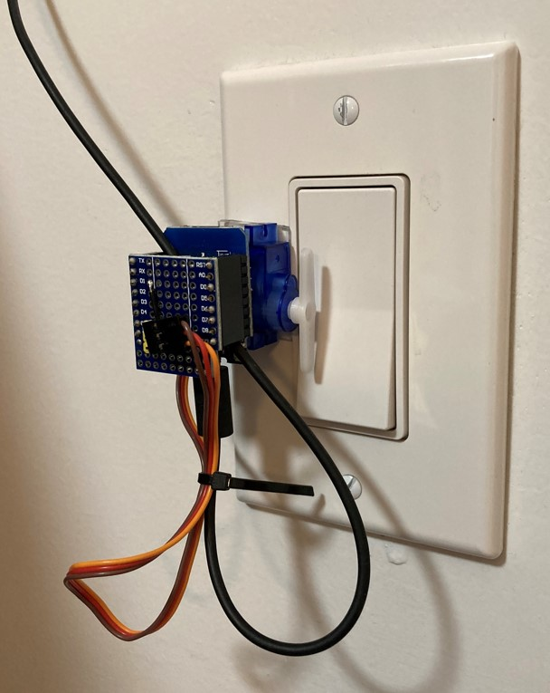
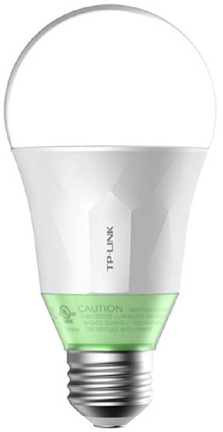
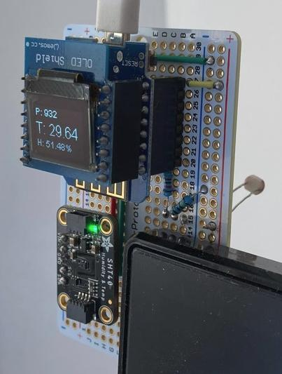

## Home Automation
### Tech list for this project
* Familar with C / Python / MicroPython Language
* Socket / Multithread Programming
* Programming on embedded system
* Web development (API, frontend/backend, Websocket, etc.)
### Component Gallery
<table>
  <tr> 
    <th>Hub-Raspberry Pi 3A</th> 
    <th>IR Receiver-VS1838B</th> 
    <th> TV remote</th>  
  </tr>
  <tr> 
    <td>  </td> 
    <td>  </td> 
    <td>  </td>
  </tr>
  <tr> 
    <th>8 Channel Relay</th> 
    <th> Ceiling Light Switch-SG90</th> 
    <th> TP_Link-LB110 </td> 
  </tr>
  <tr> 
    <td>  </td> 
    <td>  </td> 
    <td>  
  </tr>
  <tr>
    <th> </th> 
    <th>Environmental Sensor-SHT4x</th> 
    <th> </th> 
  </tr> 
  <tr> 
    <td> </td> 
    <td>  </td> 
    <td> </td> 
  </tr> 
</table>

### Material List
* Hub + Camera
  * Raspberry Pi 3A
  *  
* IR Receiver
  * D1 mini
  * VS1838B
* TV remote
* 8 Channel Relay
  * Relay
  * Homemade adapter
  * D1 mini
* Ceiling Light Switch
  * D1 mini
  * SG90 Servo
  * Homemade adapter  
* TP-Link LB110 WiFi-enabled light bulb
* Environmental Sensor
  * D1 mini 
  * Photoelectric resistor
  * SHT4x temperature/humidity sensor  
